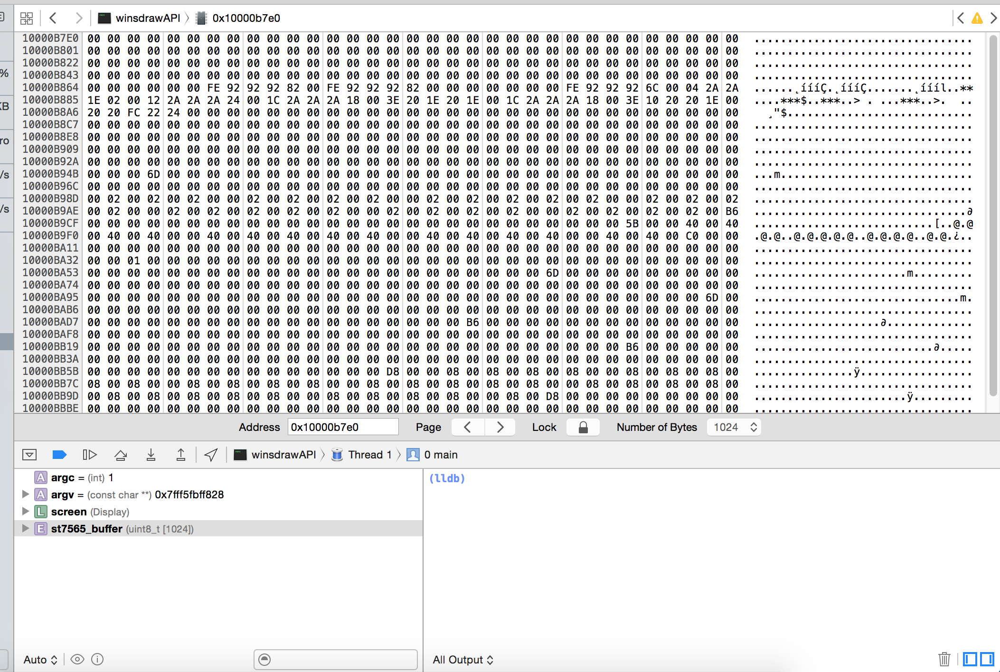
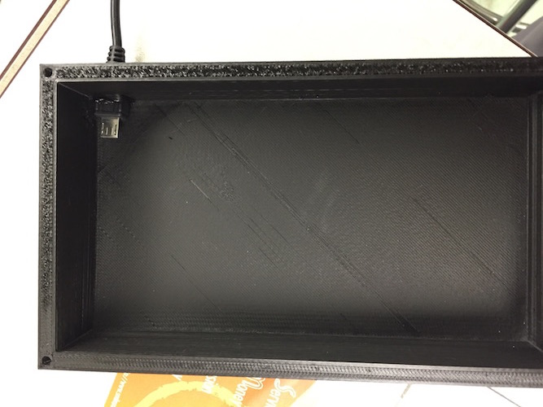
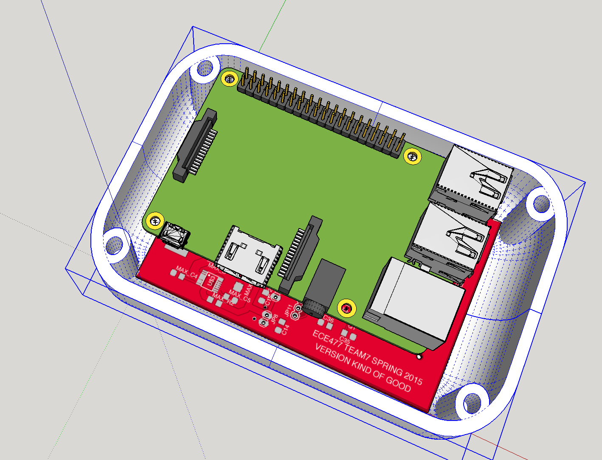

# Week 13
April 11, 2015

For the team, major tasks (not in any particular order) that we visited this past week were

- Making sense of IMU data 
- Component integration testing 
- Packaging redesign
- Map making

### Making sense of IMU data

[Siddarth Mudgal](https://engineering.purdue.edu/477grp7/Team/progress/smudgals.html) and I had some thoughtful brainstorming session this week about how are we going to combine gyroscope data with the accelerometer data. It is a difficult problem because at any given moment the end user may hold the device in any angle he wants even though he may be moving in a straight line - this will register a reading in the IMU. We have to be able to distinguish between true rotation (end-user turning at the corner of a corridor) versus a false-alarm rotation. 

In addition, given the IMU data we must also be able to figure out where the end-user have moved in space.

To do the latter, we will sample the IMU for angular velocity $$(\omega_x, \omega_y, \omega_z) $$ and translational  $$(a_x, a_y, a_z) $$ acceleration at a small sampling rate that we can confidently assume that the any acceleration are constant in this small time period. Then we can try to figure out the net direction of the IMU. 

However the IMU6050 comes with a DMP (digital motion processor) that has uses a sophisticated proprietary algorithm called MotionFusion™ to combine raw IMU outputs into quaternion output. I am unaware of the detail of how [Unit Quaternion](http://en.wikipedia.org/wiki/Quaternions_and_spatial_rotation) represention of rotation works at time of writing.

We feel like we should be able to access the DMP onboard the IMU6050 using the following [library](https://github.com/jrowberg/i2cdevlib/blob/master/Arduino/MPU6050/MPU6050_6Axis_MotionApps20.h). We will be attempting to do that next week - probably first with an Arduino or Raspberry Pi. The fallback plan is to use [RTIMULib](https://github.com/richards-tech/RTIMULib) to perform all the quaternion math necessary.

We'll be devoting a lot of time to this next week. Ability to do inertial navigation from IMU input is in our PSSC so it is imperative that it is completed as soon as possible.

### Component integration and testing

We have resolved the battery issue described in previous week's progress report by adding a 330 uF capacitor in parallel to 5V regulator's power and ground as suggested by the TAs. 

[Daulet Kenzhebalin](https://engineering.purdue.edu/477grp7/Team/progress/dkenzheb.html) finished soldering the parts onto the PCB version "Kind of good". We have verified that everything is working fine on the hardware side. I added an on/off switch to the PCB and now our a PCB is 99% complete - we can now easily switch our PCB between OFF (active charging) and ON mode. 

LCD was tested and worked from the PIC but is not yet integrated into the main software package. 

I ran the code that draws the main menu on my computer and using a very powerful Xcode C++ debugging tool, I was able to extract the content of memory for the portion that is assigned to the LCD buffer which looks like:

 

*Figure 0A.*  Xcode's built-in debugger

I copied and pasted this (with minimal effort) into some text editor, add a bunch of `0x` to the beginning of every memory location, add a comma between it, concatenate the entire string with `}` and `{` in the front (so that it is in the form of `{ 0x00, 0x01,.... 0xFF }`, initialize the buffer to that vector and drives the LCD with the following outcome.

 

*Figure 0B.*  LCD

The keypad software (mentioned in previous week progress report) was integrated successfully into the main package's Keypad thread. We tested this by starting the program with our simulator software attached. It brings up the menu in the simulator (similar to the one in Figure 0B), when we press `3` on the keypad it changes screen and display "Shutting down" message and the process gracefully exits. I call that a success.

We also received our 3D printed package from IEEE, I will write more on this in the next section (below). 

### Packaging redesign

The packaging needs to be refined a little more to fit the PCB, the Raspberry Pi and the battery pack without touching each other too much. To do that we need to add more standoff mounting holes. The micro USB hole was slightly too small (and out of shape). In fact the package (which was intended to be rectangular) has a slight curve to it at the bottom corners making it looks more like a boat. I highly doubt that it is due to the imprecision of the Makerbot printer since the Makerbot uses stalagmite technique: materials are laid down on a platform from the bottom up. For the next version we will be using the FormLab Form +1 printer in EE063 as it uses a more precise FDM to extrude small bead of plastic and laser to perform photopolymerization. 

 

*Figure 1.*  Current version. We'll be throwing it away soon.

On a more exciting note, I found out that you can import Eagle PCB into Sketchup - with precise width, height and thickness. The purpose is to give you an idea of where things will sit in your package. This is done via a nifty Sketch Up plugin called [eagle up](https://eagleup.wordpress.com). See below for pictures.

 

*Figure 2.* New Redesigned Package with internals and top view of PCB

 

*Figure 3.* New Redesigned Package with internals from an angle

*Figure 4.* New Redesigned Package with internals hidden

### Map making

We need to be produce a map file that is accurate representation of the real map. 